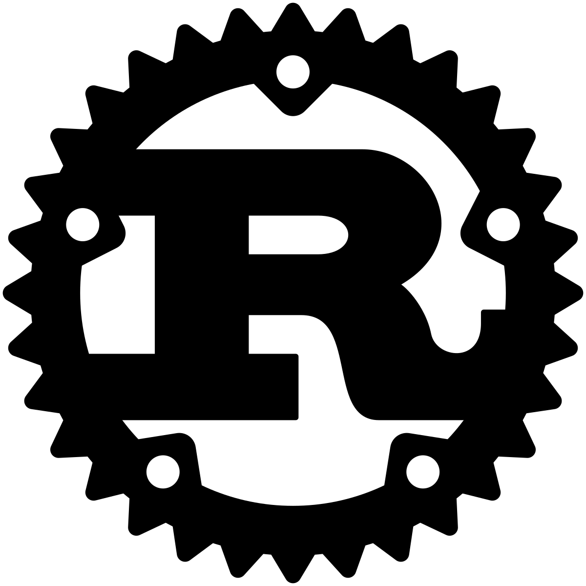
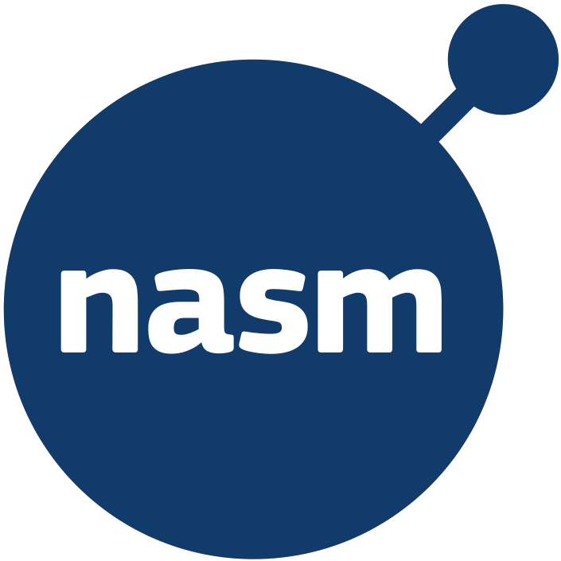

# Welcome to my Github!

## I'm currently learning these languages:

<table> <tr> <td valign="center">  Javascript   </td> </tr> </table><table> <tr> <td valign="center">  Typescript   </td> </tr> </table><table> <tr> <td valign="center">  Rust   </td> </tr> </table><table> <tr> <td valign="center">  C   </td> </tr> </table><table> <tr> <td valign="center">  C++   </td> </tr> </table><table> <tr> <td valign="center">  NASM   </td> </tr> </table>
